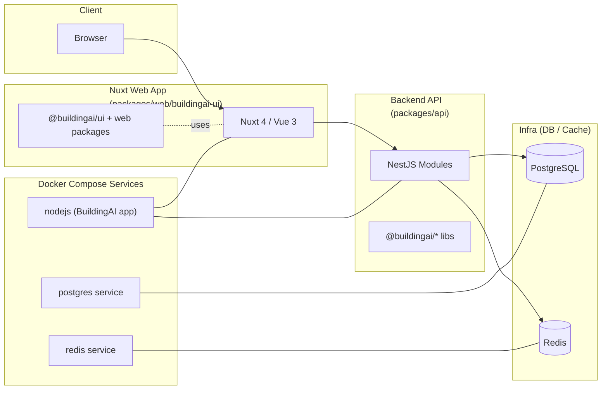

# Onboarding Summary from Early TODOs (2025-11-22 ~ 2025-11-23)

> 本文件總結 2025-11-22 ~
> 2025-11-23 期間的技術探索成果，作為之後任何人（包含未來的自己與 AI 助手）快速理解 BuildingAI 專案的入口。細節請搭配各專題文件（`*_OVERVIEW.md`、`ui-flow-*.md`、各日 TODO）閱讀。

## 目錄

- [1. 專案與技術棧總覽](#1-專案與技術棧總覽)
- [2. 已建立的核心說明文件](#2-已建立的核心說明文件)
- [3. 已深度閱讀的核心功能鏈路（feature-a--d）](#3-已深度閱讀的核心功能鏈路feature-a--d)
- [4. Build 與 Docker 驗證（第一階段總結）](#4-build-與-docker-驗證第一階段總結)
- [5. 第二階段-docker-升級規劃（初稿）](#5-第二階段-docker-升級規劃初稿)
- [6. day1–2-的整體成果與下一步建議](#6-day12-的整體成果與下一步建議)

---

## 1. 專案與技術棧總覽

- **專案類型**：
    - pnpm + Turbo 的 **monorepo** 結構。
    - 前端 Nuxt 4 / Vue 3 / TailwindCSS。
    - 後端 NestJS / TypeORM + PostgreSQL。
    - Redis / Postgres / Node 透過 Docker Compose 啟動。

- **關鍵檔案 / 入口**：
    - `package.json`（root）：定義 build / dev / docker 指令，以及 monorepo 共用 dependencies。
    - `pnpm-workspace.yaml`：workspace 結構。
    - `turbo.json`：turbo 任務與 cache 設定（build、dev 等）。
    - `docker-compose.yml`：Redis / Postgres / Nodejs 三個主要服務的 Docker 定義。

- **Frontend & UI Tech Stack（UI 技術棧）**  
  參見：[README.md](./README.md) / [README.zh-CN.md](./README.zh-CN.md) /
  [FRONTEND_ARCH.md](./FRONTEND_ARCH.md)
    - **Framework**：NuxtJS 4（基於 Vue 3 + Vite 7）。
    - **UI Library**：Nuxt UI 3。
    - **State Management**：Pinia。
    - **Styling**：TailwindCSS + design tokens。
    - **Internal UI Packages**：`@buildingai/ui` 與多個 `packages/web/@buildingai/*`
      套件，共用一套設計系統，支援官網、Console、安裝流程等多個前端應用。

- **Backend & Infra Tech Stack**  
  參見：[API_OVERVIEW.md](./API_OVERVIEW.md)、[todo2025-11-22-06.md](./todo/todo2025-11-22-06.md) 等
    - **API Framework**：NestJS 11.x。
    - **ORM / DB**：TypeORM 0.3.x + PostgreSQL 17.x。
    - **Cache / Queue**：Redis、BullMQ（queue）。
    - **編譯與建置**：TypeScript 5.x、Turbo 2.x、pnpm 10.20.0。

### 專案高階架構圖（Mermaid）



---

## 2. 已建立的核心說明文件

> 這些文件在 Day1-2 中陸續建立／補完，是之後進一步理解與重構的基礎。

- **專案與架構總覽**：
    - [PROJECT_OVERVIEW.md](./PROJECT_OVERVIEW.md)（來自 TODO 01-02）：
        - 說明 monorepo 大致結構、主要 packages、技術棧。
    - [FRONTEND_ARCH.md](./FRONTEND_ARCH.md)（TODO 02）：
        - 聚焦 `packages/web/buildingai-ui` 的 Nuxt 啟動流程、路由架構、Pinia stores。
        - 補充了 **Frontend & UI Tech Stack（UI 技術棧）** 的正式用語。

- **功能 Flow / UI Flow 文件**：
    - [ui-flow-install.md](./ui-flow-install.md)（Feature A - Install Flow）：
        - 安裝精靈 `/install` 的畫面步驟、API 互動、系統初始化邏輯。
    - [ui-flow-login.md](./ui-flow-login.md) (Feature B - Login/Auth Flow)：
        - 登入 / 註冊 / 驗證流程、與後端 auth 模組對應。
    - [ui-flow-chat.md](./ui-flow-chat.md) (Feature C - Chat Flow)：
        - 聊天 UI、與 `/ai-chat/stream` 及對話相關 API 的互動流程。
    - [ui-flow-console-ai-provider.md](./ui-flow-console-ai-provider.md) (Feature D1 - Console AI
      Provider 管理)：
        - 後台 AI Provider 管理畫面（`list.vue` / `edit.vue`）的 UI 與狀態流程。

- **後端 API 總覽與模組理解**：
    - [API_OVERVIEW.md](./API_OVERVIEW.md)（TODO 08）：
        - 將後端大致分成：Public/Web、Console、Internal 等區域。
        - 已粗略整理的模組：system、auth/user、ai/chat、console/ai-provider 等。
        - 也寫下「目前理解程度」「哪些區塊可以放心調整、哪些暫不建議大改」。

- **AI 協作規則**：
    - [AI_COLLAB_RULES.md](./AI_COLLAB_RULES.md)（2025-11-23 建立）：
        - 定義與 AI 合作的 **三種模式**：
            - Mode 1：Explore / Understand Only（只讀不改）。
            - Mode 2：Design / Propose Changes（只出方案不動檔）。
            - Mode 3：Implement / Refactor（小步實作＋回寫文件）。
        - 全局原則：理解優先於修改、文件優先於程式碼、小步快跑、嚴控部署／DB 等風險區域。

---

## 3. 已深度閱讀的核心功能鏈路（Feature A ~ D）

這一部分主要來自 Day1-2 的 TODO 01–08 對應內容與 `ui-flow-*.md`。

### 3.1 Feature A：安裝流程（Install Flow）

- 入口：`/install`。
- 目的：完成系統初始化（DB schema、初始管理員、基本站點設定）。
- 前端要點：
    - 多步驟安裝精靈（表單驗證、測試連線、確認設定）。
    - 與後端 system / install 相關 API 呼叫緊密綁定。
- 後端要點：
    - 檢查系統是否已初始化，決定是否允許再次進入安裝流程。
    - 可能涉及 DB schema 建立與 migration（TypeORM / 手動腳本）。

### 3.2 Feature B：登入 / 認證流程（Login / Auth Flow）

- 入口：`/login` 及其子路由。
- 前端要點：
    - 使用 Pinia `user` store 管理 token、使用者資訊與登入狀態。
    - 全域路由 middleware `route.global.ts` 中會依據 `isLogin` 與權限決定導向（登入頁 / Console
      / 錯誤頁）。
- 後端要點：
    - auth 模組處理 JWT、登入驗證、token 續期。
    - console 區域路由需驗證權限碼與角色。

### 3.3 Feature C：聊天功能（AI Chat Flow）

- 相關後端模組（來自 TODO 06 / API_OVERVIEW）：
    - `ai/chat/controllers/web/ai-chat-message.controller.ts`：
        - 處理前台 Web 聊天 API 請求（含 SSE / streaming）。
    - `ai/chat/handlers/chat-completion.handler.ts`：
        - 負責聊天完成邏輯，包含模型調用、工具呼叫、多輪對話與 SSE 推送。
    - `ai/chat/handlers/conversation.handler.ts`：
        - 負責對話建立、訊息保存與標題更新。
    - `ai/chat/handlers/model-validation.handler.ts`、`user-power-validation.handler.ts`、`power-deduction.handler.ts`：
        - 負責模型存在性檢查、使用者積分驗證與扣點邏輯。
    - `ai/chat/handlers/mcp-server.handler.ts`、`tool-call.handler.ts`：
        - 負責 MCP server 初始化、工具列表取得與工具呼叫追蹤。
- 前端 UI：
    - 已整理於 `ui-flow-chat.md`，描述訊息輸入、streaming 回覆渲染、工具結果顯示等行為。

### 3.4 Feature D1：Console AI Provider 管理

- 相關檔案：`list.vue`、`edit.vue`（console AI
  Provider 管理 UI）、`ui-flow-console-ai-provider.md`。
- 前端要點：
    - 提供多種 AI Provider（OpenAI 等）的列表與編輯頁面。
    - 使用共用 layout + 菜單 / 權限系統，由後端回傳的 menu config 驅動動態路由。
- 後端要點（初步）：
    - Console API 專用的 AI Provider CRUD 模組，與 system / model 管理有關。
    - 由 `consoleapi` 前綴的路由對應。

---

## 4. Build 與 Docker 驗證（第一階段總結）

詳細記錄見：[todo2025-11-22-09.md](./todo/todo2025-11-22-09.md)

### 4.1 環境資訊

- **Node**：>= 22（由 `package.json` engines 指定）。
- **pnpm**：10.20.0。
- **Docker**：Docker version 28.4.0。

### 4.2 Build 流程與結果

- 初次直接執行 `pnpm build`：
    - 指令實際為：`cross-env NODE_OPTIONS=--max-old-space-size=5120 turbo run build`。
    - 因為尚未 `pnpm install`，出現：
        - `'cross-env' 不是內部或外部命令...`（command not found）。
        - `Local package.json exists, but node_modules missing, did you mean to install?`。
- 後續步驟：
    - 在 root 執行 `pnpm install`，安裝所有 workspace 依賴。
    - 單獨執行 `pnpm --filter @buildingai/base build` 成功，確認 `@buildingai/base` 的 TypeScript
      build 與 `dist/` 輸出正常。
    - 再次執行 `pnpm build`：
        - Turbo 輸出：`Tasks: 20 successful, 20 total`，exit code 0。
        - 結論：
            - 在完成依賴安裝後，整體 monorepo build
              pipeline 可以順利跑完；先前錯誤屬於「環境未初始化完整」，而非程式碼編譯問題。

### 4.3 Docker 啟動與觀察

- 指令：`pnpm docker:up`（對應 `docker compose up -d`）。
- `docker-compose.yml` 關鍵設計：
    - **redis**：
        - image：`ccr.ccs.tencentyun.com/buildingai/redis:8.2.2`。
        - 帶有健康檢查 `redis-cli -a $REDIS_PASSWORD ping`。
    - **postgres**：
        - image：`ccr.ccs.tencentyun.com/buildingai/postgres:17.6`。
        - 環境變數來自 `DB_USERNAME` / `DB_PASSWORD` / `DB_DATABASE`，並有 `pg_isready` 健康檢查。
    - **nodejs**：
        - image：`ccr.ccs.tencentyun.com/buildingai/node:22.20.0`。
        - 將本機整個 repo `./` 掛載到容器 `/buildingai`（bind mount）。
        - 在容器中執行 `pnpm start --no-daemon`，直接跑當前這份程式碼，而不是預先 build 好的 app
          image。
        - 依賴環境變數：`SERVER_PORT`（預設 4090）、DB/Redis 連線設定等。
        - 健康檢查會打 `http://localhost:${SERVER_PORT}/consoleapi/health`，或檢查 pm2 狀態。

- 首次啟動觀察：
    - `docker ps -a`：
        - `buildingai-redis`、`buildingai-postgres`：`Up (healthy)`。
        - `buildingai-nodejs`：`Up (health: starting)`，且 log 中出現大量：

            ```text
            Progress: resolved 2198, reused 0/多, downloaded ..., added ...
            ```

        - 代表容器內正在執行 `pnpm install`，對整個 monorepo 安裝依賴，第一次可能接近一小時。

    - 待安裝與啟動流程完成後：
        - 透過瀏覽器存取 `http://localhost:4090/install`、`/consoleapi/health` 已可正常回應。
        - 表示 API / Web 服務最終正確啟動。

- 結論：
    - 本機環境下：
        - `pnpm build` 與 `pnpm docker:up` 都已被實際驗證可成功執行。
        - Docker 啟動模式偏向「開發／快速體驗」：使用 Node base image + bind mount + 容器內
          `pnpm install` + `pnpm start`，非正式 app image。

---

## 5. 第二階段 Docker 升級規劃（初稿）

詳細規劃見：[todo2025-11-23-01.md](./todo/todo2025-11-23-01.md)

- 目標：
    - 降低首次與每次啟動時的等待時間（避免每次都在容器內跑完整 `pnpm install`）。
    - 提供一個更接近正式部署的「應用 image」路線，同時保留目前開發友好的 bind mount 方案。

- 初步構想：
    - **Multi-stage Dockerfile（應用 image）**：
        - Builder stage：
            - `FROM node:22`。
            - `WORKDIR /app`，`COPY . .`。
            - 啟用 pnpm，`pnpm install --frozen-lockfile`。
            - `pnpm build`，產生後端 `dist/`、前端 `.output/` 等編譯產物。
        - Runtime stage：
            - `FROM node:22-slim`（或類似精簡 image）。
            - 只 `COPY` 必要的 build 產物與設定檔。
            - 設定 `NODE_ENV=production`，暴露 4090 埠，`CMD` 啟動 API/Web。

    - **Compose 分環境策略**：
        - 保留現有 `docker-compose.yml` 給本機開發／快速體驗用途（bind mount + pnpm start）。
        - 新增一份 `docker-compose.prod.yml` 或 `docker-compose.local.yml`：
            - Node 服務改用自建的 app image（`build: .` 或固定 `image: buildingai-app:tag`）。

    - **Redis / Postgres image 優化**：
        - 評估從 `ccr.ccs.tencentyun.com` 改為 Docker Hub 官方 image（`redis:8.2.2` /
          `postgres:17.6`），特別是本機開發環境，以減少從大陸 registry 拉取的延遲。

目前此部分仍停留在設計階段，尚未實際修改 Dockerfile /
compose；所有實作預計分步進行，每一步都會對應新的 TODO 條目與驗證紀錄。

---

## 6. Day1–2 的整體成果與下一步建議

### 6.1 已達成的理解層級（約略）

- **專案地圖**：
    - 對 monorepo 結構、主要 packages（API / Web / @buildingai/\*）有清楚的鳥瞰。
- **前端（Nuxt Web）**：
    - 已掌握主要啟動流程、路由架構、Pinia stores，以及 Console 動態路由與權限邏輯。
- **後端（API）**：
    - 對 system / auth / chat / console AI Provider 等模組的路由與責任分工有初步理解。
    - 對聊天模組內部 handlers（模型驗證、積分驗證、MCP、工具呼叫）有較深一層的認識。
- **功能鏈路**：
    - Install / Login / Chat / Console AI Provider 四條核心 flow 已各自有獨立文件描述。
- **Build & Docker**：
    - 已證實在當前環境下可以完整 build 並以 Docker 啟動整套服務，清楚知道首次啟動為何會很慢（image 拉取 + 容器內
      `pnpm install`）。
- **AI 協作規則**：
    - 有一套明文化的 AI 協作規則（`AI_COLLAB_RULES.md`），未來可複用在其他 AI 助手或新成員身上。

### 6.2 後續建議方向

- **A. 完成 Day1–2 的高階 ONBOARDING 圖像**（本檔即為初版）
    - 未來可視需要：
        - 加上簡單架構圖（package dependency / service diagram）。
        - 加上「可以放心修改的區塊」與「暫時不建議重構的區塊」清單。

- **B. 依照 TODO 2025-11-23-01，逐步實作 Docker 升級**
    - 從測量現有啟動時間開始，逐步設計並驗證 multi-stage Dockerfile 與分環境 compose。

- **C. 深入特定後端模組（例如 Chat C-API）**
    - 將目前對 chat handlers 的理解，進一步延伸到：
        - 完整 API 列表（路由、HTTP method、參數）。
        - 錯誤處理與觀察指標（log、metrics）。

---

> 本檔作為「Day1–2 知識壓縮檔」，建議未來所有中大型改動（特別是部署、底層架構、權限與金流相關重構）前，都先回顧此檔與對應的
> `*_OVERVIEW.md` / `ui-flow-*.md`，確認自己對現狀的理解已經足夠，再進入設計與實作階段。
